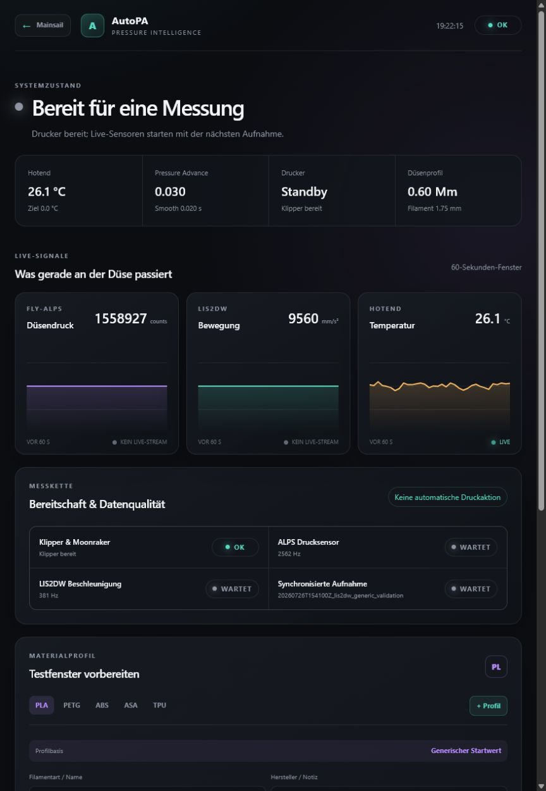

# AutoPA for Mellow FLY-ALPS and Klipper

[English](README.md) | [Deutsch](README.de.md) | [Changelog](CHANGELOG.md)

[](https://github.com/incendiumendy/AutoPA/actions/workflows/tests.yml)

AutoPA records nozzle-force data from a Mellow FLY-ALPS together with real
toolhead acceleration from the LIS2DW on an EBB42 Gen2. The streams are aligned
on Klipper's `print_time` clock and will be used for a supervised,
sensor-assisted Pressure Advance sweep.



An optional local dashboard displays live force, movement, temperature,
Pressure Advance, measurement health and editable PLA/ABS/PETG/ASA/TPU test
profiles. Its experimental controller defaults to a command-free dry-run and
requires two independent unlocks before it can make bounded runtime changes.
Nozzle load is shown relative to its learned baseline on a signed
`− / 0 / +` scale, while motion separates gravity-free X/Y direction and Z
deflection.
See
[local live dashboard](docs/DASHBOARD.md).

The passive recorder manager can switch live data on with one click while idle,
attach to an already running or later starting print, continue without an open
browser and stop the synchronized ALPS/motion capture when the print ends.
Starting or stopping this measurement sends no printer G-code.

Material profiles can also define a separately locked, filename-triggered
Klipper chamber filter with selectable `fan_generic`, speed and post-run time.
See [chamber filter documentation](docs/CHAMBER_FILTER.md).

The project targets both ordinary Klipper/Moonraker installations and RatOS.
It does not replace RatOS configuration files.

> Status: experimental development project. Acquisition and clock alignment
> are validated on one RatOS printer. Adaptive PA and Auto-Retract are not yet
> validated on a print and must first be evaluated in dry-run. Never apply
> them unattended.

## Validated hardware

- Rat Rig V-Core 3 300 with RatOS
- Mellow FLY-ALPS firmware `2.0.0`, USB through the validated EBB42 Gen2
  passthrough or a powered/stable hub
- BTT EBB42 Gen2 over USB
- EBB42 onboard LIS2DW as `lis2dw toolboard_t0`
- Existing digital ALPS probe on EBB42 pins PA5 (enable) and PA4 (trigger)

## Preferred architecture

```text
Raspberry Pi / RatOS or Klipper
`- stable USB uplink -> EBB USB Adapter -> EBB42 Gen2 (USB mode)
   |- normal toolboard functions and LIS2DW acceleration
   `- USB passthrough -> Mellow FLY-ALPS factory firmware
      |- USB CDC force stream
      `- digital trigger remains connected to the EBB42
```

The EBB42 **Gen2** passthrough follows its selected communication mode and can
carry the ALPS USB connection while the board is in USB mode. This exact path
was validated with stable EBB42 and ALPS device IDs, live AutoPA acquisition
and a ten-minute disconnect monitor. It is not a general claim about older EBB
revisions. See the bilingual
[EBB42 Gen2 USB passthrough guide](docs/EBB42_GEN2_USB_PASSTHROUGH.md).

The direct ALPS-to-Pi connection was unstable on the validated machine. A USB
hub restored reliable operation; the later EBB42 Gen2 passthrough test was also
stable. See [USB stability](docs/USB_STABILITY.md).

## Why the ALPS is not flashed

The public Mellow firmware exposes force samples over USB while its digital
probe output continues to work. This was verified before and after a combined
ten-second ALPS/LIS2DW capture.

Flashing Klipper onto the ALPS would remove the factory digital-probe behavior.
That path is retained only as an experimental reference under `firmware/`,
`backport/` and `config/ALPS-load-cell.cfg.example`. It must not be used until a
complete and independently validated `load_cell_probe` replacement or another
Z probe exists.

## Current validated result

The first combined idle dataset produced:

| Check | Result |
| --- | ---: |
| ALPS firmware | 2.0.0 |
| ALPS force samples | 25,970 in 10 s |
| ALPS sample rate | 2,596.98 Hz |
| LIS2DW acceleration samples | 3,880 in about 10 s |
| LIS2DW sample rate | 385.87 Hz |
| LIS2DW errors / overflows | 0 / 0 |
| Clock-fit RMS residual | 0.0011 ms |
| Clock-fit maximum residual | 0.0021 ms |
| Derived aligned rows | 3,853 |
| Digital probe state | unchanged |

A second five-second run validated the complete marker path:

- 12,986 force samples and 1,944 acceleration samples;
- zero errors and zero overflows;
- one `AUTOPA_MARK` event preserved in `events.csv`;
- clock-fit maximum residual 0.00035 ms;
- Klipper remained ready/standby and the probe state remained unchanged.

Raw machine datasets and printer backups are intentionally excluded from Git.

## Repository layout

```text
src/autopa/
  alps_serial.py     Mellow USB protocol reader
  sync_recorder.py   simultaneous ALPS/LIS2DW recorder
  align.py           monotonic-time to Klipper print-time alignment
  diagnose.py        non-moving live endpoint and safety checks
  calibration.py     per-machine multi-point force calibration
  filament.py        advisory lost-extrusion-pressure detection
  material.py        filament consistency and temperature comparison
  temperature_plan.py safe per-temperature sweep file generator
  dashboard.py       local status and opt-in bounded control server
  adaptive.py        dry-run PA/retraction estimator and guarded controller
  gcode_context.py   safe slicer-context parser and copy instrumenter
  quality.py         acquisition and idle-baseline diagnostics
  sweep.py           bounded Klipper PA sweep generator
klipper/extras/
  autopa_clock.py    clock endpoint, exact G-code markers and safety check
config/
  autopa.cfg         minimal Klipper include
docs/                installation, protocol, compatibility and safety notes
tests/               dependency-free unit tests
dashboard/           responsive browser interface and static production build
integrations/mainsail native movable AutoPA and Local Vision panels
```

## Install the safe factory-firmware mode

The only Klipper-side component required for this mode is
`klipper/extras/autopa_clock.py`. It:

- reports the Linux-monotonic/Klipper-print-time mapping;
- records exact `AUTOPA_MARK` boundaries;
- provides `AUTOPA_VALIDATE` to check homing, Z clearance, X travel and hotend
  extrusion readiness;
- optionally verifies that the requested nozzle target and measured
  temperature match the temperature-bound sweep within a configured
  tolerance.

It does not read or change the probe, move an axis, change PA, or flash an MCU.
See [factory-mode installation](docs/INSTALL_FACTORY_MODE.md).

After changing an already imported Klipper Python extra, use a real Klipper
service restart. A G-code `RESTART` reloads configuration but keeps imported
Python modules cached in the same process.

## Capture and align

On the Raspberry Pi:

```sh
cd ~/printer_data/autopa-project
PYTHONPATH=src python3 -m autopa.sync_recorder \
  --alps-device /dev/serial/by-id/usb-STMicroelectronics_PressureLeveling_YOUR_ID-if00 \
  --accelerometer-type lis2dw \
  --accelerometer toolboard_t0 \
  --duration 10 \
  --name idle_10s

PYTHONPATH=src python3 -m autopa.align \
  ~/printer_data/autopa/<dataset>

PYTHONPATH=src python3 -m autopa.quality \
  ~/printer_data/autopa/<dataset>

PYTHONPATH=src python3 -m autopa.analyze \
  ~/printer_data/autopa/<dataset>
```

The recorder writes raw force, acceleration, batch diagnostics, clock pairs,
G-code events and a manifest. Alignment and quality analysis create new
derived files and never rewrite the raw evidence.

The motion channel is optional. AutoPA supports Klipper's LIS2DW, LIS3DH,
ADXL345 and MPU9250 data endpoints; use `--accelerometer-type none` for a
force-only capture. See
[optional accelerometers](docs/ACCELEROMETERS.md).

## Add exact G-code context

AutoPA can create a separate instrumented copy of an ordinary sliced file:

```sh
PYTHONPATH=src python3 -m autopa.gcode_context \
  model.gcode model.autopa.gcode
```

The source is never modified. Context markers identify the executed layer,
Z height, slicer feature and object on Klipper's real `print_time` axis rather
than relying on Moonraker's look-ahead-affected file position. Missing or
unsupported context never interrupts a print; it suppresses context-assisted
PA evaluation instead. See the bilingual
[G-Code Context Engine guide](docs/GCODE_CONTEXT.md).

For Mainsail `2.18.2`, AutoPA also provides separate native AutoPA and Local
Vision panels that can be moved, hidden and collapsed with Mainsail's normal
dashboard settings. The AutoPA tile shows only compact live/context data. The
Local Vision tile provides supervised camera calibration behind its own
checkbox, confirmation dialog and server-side motion gates. See
[native Mainsail tiles](docs/MAINSAIL_TILE.md).

Repeated quality-approved runs can be pooled without admitting rejected data:

```sh
PYTHONPATH=src python3 -m autopa.analyze \
  ~/printer_data/autopa/<dataset-1> \
  ~/printer_data/autopa/<dataset-2> \
  --output ~/printer_data/autopa/combined-analysis.json
```

Each PA value still requires at least three included cycles. The result remains
experimental and always sets `apply_automatically` to `false`.

Different ALPS boards and hotend mechanics can use an optional multi-point
calibration for offset, polarity and counts-to-force conversion. PA metrics
remain locally normalized even without it. See
[per-machine calibration](docs/CALIBRATION.md).

## Generate a supervised smoke sweep

First obtain the current PA value from Klipper. It is mandatory as
`--restore-advance`, so the generated file restores that value at the end.

```sh
PYTHONPATH=src python3 -m autopa.sweep \
  --k-start 0.01 \
  --k-stop 0.05 \
  --k-step 0.02 \
  --cycles 3 \
  --restore-advance 0.03 \
  --output autopa-smoke.gcode
```

The example assumes the printer's current value is `0.03`; always replace
`--restore-advance` with the value reported by your own printer. It uses
25.2 mm of filament and takes about 11.25 seconds, excluding acceleration and
command overhead. Every cycle:

1. moves X by +8 mm over one second while extruding slowly;
2. returns X by -8 mm over 0.25 seconds while extruding quickly;
3. ends at exactly the starting X coordinate.

The X component is required because the validated Klipper version only enables
Pressure Advance for positive extrusion moves with X or Y motion. It also gives
the LIS2DW a real movement signal for rejecting mechanical artifacts.

Before any sweep:

- home X/Y/Z;
- move the nozzle into free air, at least 10 mm above the bed;
- heat the loaded filament to a safe extrusion temperature;
- place a purge container below the nozzle;
- verify the requested +X travel remains inside the build area;
- remain at the printer with emergency stop available;
- start the recorder before executing the generated G-code.

`AUTOPA_VALIDATE` rejects the file if axes are not homed, Z is too low, the +X
move would exceed the axis limit, or the hotend is too cold.

## Generate a supervised retraction sweep

`retract_sweep` varies Klipper `[firmware_retraction]` lengths through marked
`G10`/dwell/`G11` cycles and `retract_analyze` ranks them by residual nozzle
pressure and restart behavior. The current retraction length is mandatory as
`--restore-retract`, so the file restores it at the end:

```sh
PYTHONPATH=src python3 -m autopa.retract_sweep \r
  --r-start 0.2 \r
  --r-stop 1.4 \r
  --r-step 0.2 \r
  --cycles 5 \r
  --restore-retract 0.8 \r
  --output autopa-retract-smoke.gcode
```

The recommendation is fail-closed, experimental and never auto-applied.
See [supervised firmware-retraction sweep](docs/RETRACT_SWEEP.md).

## Project boundaries

- Normal printing is fail-open: recording or sensor failures never pause,
  cancel or emergency-stop a print.
- Analysis is fail-closed: missing, delayed, clipped or implausible data
  suppresses the PA recommendation.
- Context-assisted PA is also fail-closed: only an eligible feature marker
  whose Klipper `print_time` has been reached may open a PA evidence window.
- Recording and dry-run never change PA or retraction.
- Every apply is runtime-only, and AutoPA never writes the printer
  configuration. Klipper's `SAVE_CONFIG` cannot persist pressure advance or
  firmware retraction anyway: only modules that register a value through
  `configfile.set()` reach the autosave block, and neither `extruder.py` nor
  `firmware_retraction.py` does. The dashboard shows the configuration lines
  to paste instead.
- Analysis will first return a recommendation with confidence and per-cycle
  evidence.
- Experimental live application is separately enabled, transiently armed,
  rate-limited, total-delta-limited and restored to its starting runtime values
  when disarmed or after the print.
- Auto-Retract applies only to Klipper `[firmware_retraction]` and sliced
  `G10`/`G11`; it cannot rewrite raw extruder retraction moves in an ordinary
  sliced G-code file.
- Normal probing stays on the factory digital ALPS signal.
- `TEST_RESONANCES` is not run during printing; AutoPA only passively records
  LIS2DW samples.
- A project update may update only AutoPA files and its own service. It must not
  update RatOS, Klipper, Moonraker or MCU firmware.

The complete policy and current quality thresholds are documented in
[fail-open printing](docs/FAIL_OPEN.md).
The validation procedure and hard control bounds are documented in
[adaptive PA and Auto-Retract](docs/ADAPTIVE_CONTROL.md).

AutoPA can also compare commanded Klipper extrusion with measured nozzle
pressure. A sustained pressure collapse can indicate broken, empty or stripped
filament, but remains advisory and cannot identify the exact cause without an
additional filament switch or motion encoder. See
[filament pressure-loss detection](docs/FILAMENT_MONITOR.md).

Temperature-dependent PA behavior can be compared across at least three stable
test temperatures. The result is an experimental sensor-derived process
window, not a substitute for stringing, degradation and layer-adhesion tests.
See [material and temperature characterization](docs/MATERIAL_TEMPERATURE.md).

## References and attribution

AutoPA is an independent implementation with its own Git history. It is **not
a fork** of PrusaPATuner, KAPAT, Klipper or RatOS. Its experimental direction
is inspired by both
[CNCKitchen/PrusaPATuner](https://github.com/CNCKitchen/PrusaPATuner) and
[vzagranichnyy/KAPAT](https://github.com/vzagranichnyy/KAPAT); their source
files are not vendored in AutoPA.

The test shape and planned analysis compare step response, phase lag and
integral area, inspired by the load-cell-based PA research in PrusaPATuner and
the Klipper/Mellow-ALPS experiment in KAPAT. PrusaPATuner targets Buddy
firmware, while KAPAT demonstrates a Klipper-specific path. AutoPA uses its own
commands, timing, acquisition and analysis implementation.

The files below `backport/klipper/` include GPLv3-licensed Klipper-derived
backport material with the upstream copyright headers retained. See
[Third-party notices](THIRD_PARTY_NOTICES.md) for the exact scope and links.

- [Mellow FLY-ALPS web tool](https://mellow.klipper.cn/en/docs/ToolsDoc/fly-alps-tool/)
- [Klipper Pressure Advance](https://www.klipper3d.org/Pressure_Advance.html)
- [Klipper resonance measurement and LIS2DW](https://www.klipper3d.org/Measuring_Resonances.html)
- [Klipper G-code command reference](https://www.klipper3d.org/G-Codes.html)
- [KAPAT Klipper experiment](https://github.com/vzagranichnyy/KAPAT)
- [FLY-ALPS / ADS131M02 development thread](https://klipper.discourse.group/t/strain-gauge-load-cell-based-endstops/2134/622)
